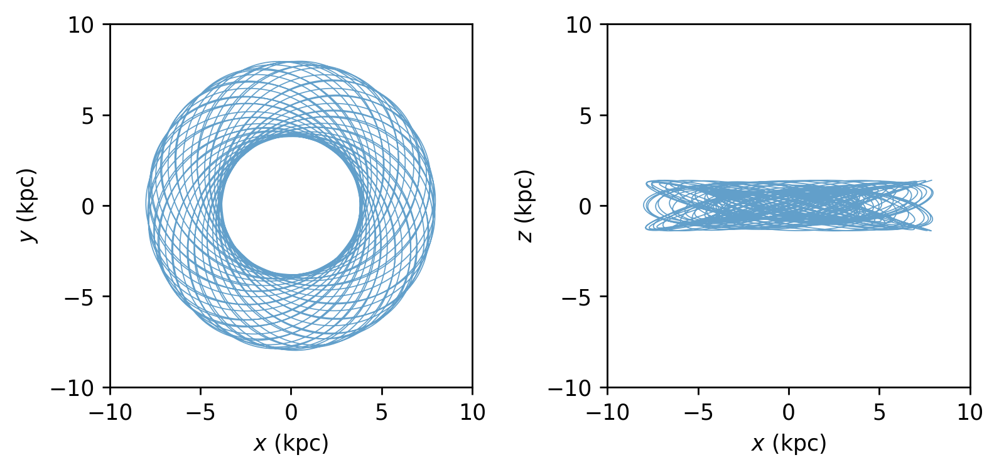
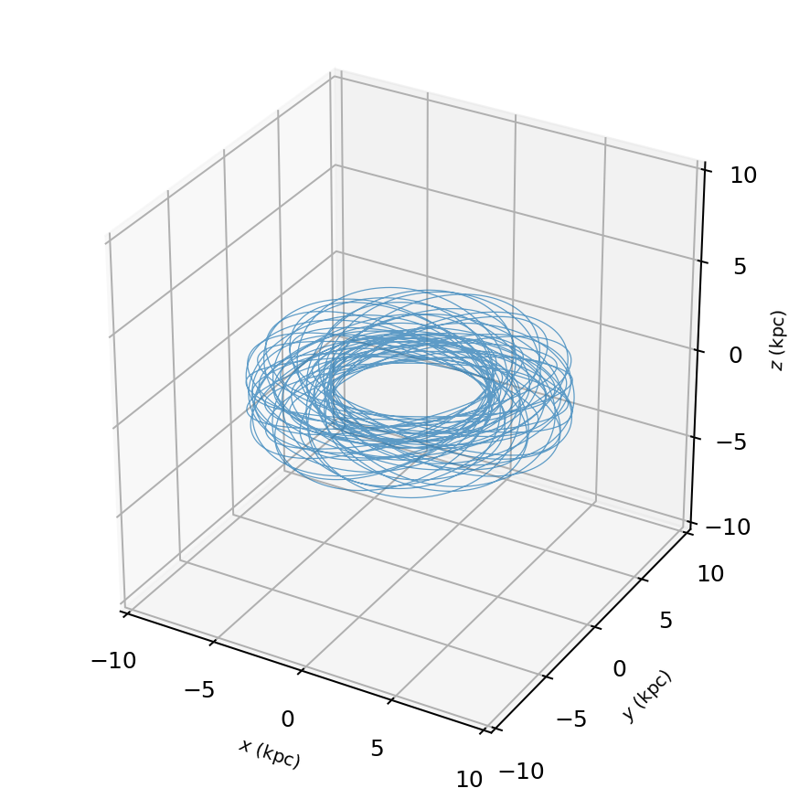
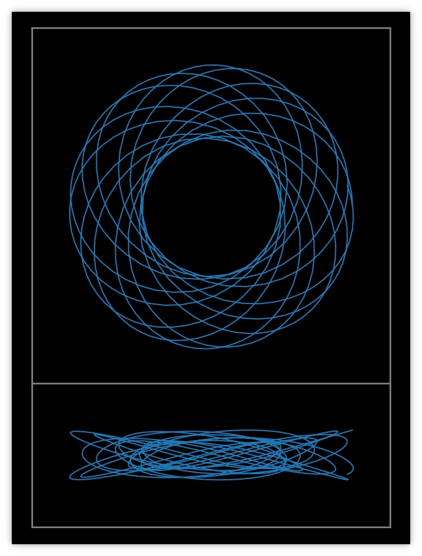

# About

The purpose of this code is to compute and visualize orbits of particles in the presence of a fixed galactic gravitational potential. The galaxy has two components: a dark matter halo and a stellar disk. The halo is represented by a spherically symmetric potential ([Hernquist, 1990](https://ui.adsabs.harvard.edu/abs/1990ApJ...356..359H/abstract)). The disk is flattened and axisymmetric ([Miyamoto & Nagai, 1975](https://ui.adsabs.harvard.edu/abs/1975PASJ...27..533M/abstract)). The forces due to these potentials are written analytically. Given initial conditions, the positions and velocities are integrated with the leapfrog method. Plots are made of the entire evolution for each initial condition. Videos animate the trajectories of the particles.

# Requirements

*  numpy
*  matplotlib
*  ffmpeg

# Usage

1 . Create a sample of initial conditions:

```
   python ic.py
```

2 . Integrate the orbits:

```
   python orbits.py
```
3 . Make figures:

```
   python plots.py
   python plots3D.py
```
4 . Make videos:

```
   python videos.py
   python videos3D.py
```

# Comments

1. The ranges of initial positions and velocities are arbitrary. In the default example, they are meant to start at the radial range from 5 to 10 kpc with roughly 200 km/s and some small vertical dispersion. These can be modified easily. Alternatively, the `ic.txt` file can be created or edited manually, with any number of lines, even one line.

2. The time integration is done using the leapfrog method with fixed time step. A small time step will increase the accurary of the calculation and improve energy conservation, at the cost of longer run time. In the default example, the integration is performed for 10 Gyr at steps of 0.001 Gyr, thus creating an output file with 10000 lines. It is possible not to save every single time step. For example, if the parameter `SaveEvery=10` were used, only 1000 lines would be written. The output frequency does not affect the run time or the accuracy.

3. The 2D plots show face-on and edge-on projections. All points in the written output are used, without downsampling. In the default example, the sizes of the square frames are 20 by 20 kpc (also 20 kpc in z in the case of the 3D plots). These png plots are not the ones used to create the videos. Step 3 can be skipped.

4. For the 2D videos, a dark background is used and the axis labels are switched off. The default ranges are 20 by 20 kpc for the face-on frame, and 20 by 8 kpc for the edge-on frame. Time labels are not shown. Creating the videos may take a few minutes. To speed up the video creation, the number of frames can be downsampled with the `step=5` parameter, for example. A large value of `step` will decrease the smoothness of the orbits. The duration of the video can be controlled with the `fps` parameter in the `ani.save()` function. For example, 10000 times doswnsampled by `step=5` means 2000 frames will be animated. At 24 frames per second, the video will last approximately 83 seconds. For the 3D videos temporary png files will be created; use `step` and `framerate` to control the duration.

# Examples








